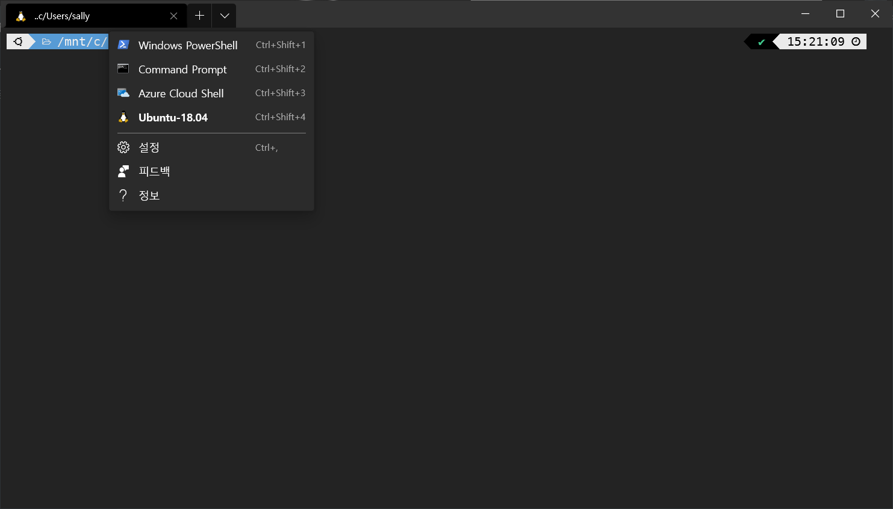
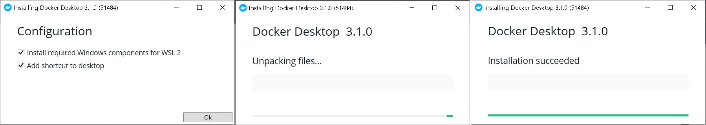
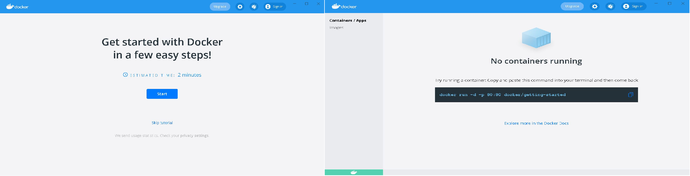
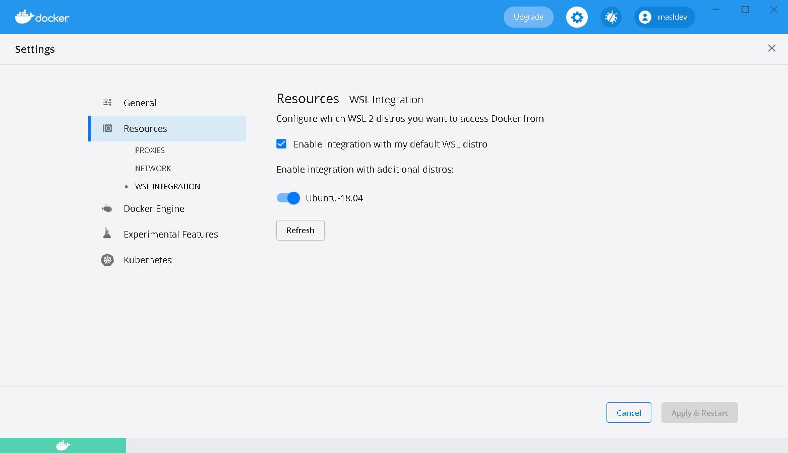
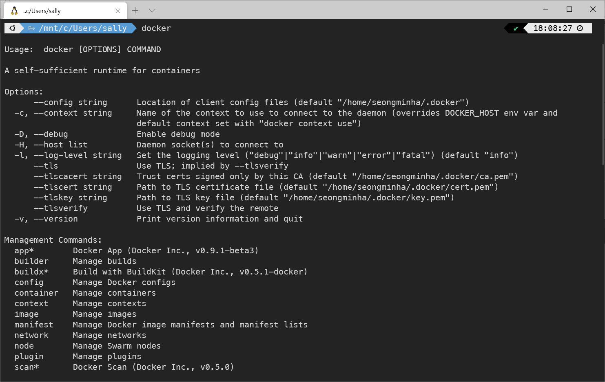

Docker 환경을 구성하기에 앞서, 알아두어야 할 점은 Docker는 Linux 환경 위에 올려야 한다는 점이다. 사용하고 있는 기본 OS가 Linux 환경이라면, 그냥 Docker를 설치하면 된다. 하지만, 여기서는 Windows 환경에서 Docker를 설치하기 위해 Linux 가상환경을 구성하는 단계부터 시작해보려고 한다.

## WSL2 환경 구성하기

WSL2는 Windows 10에서 공식적으로 지원하는 Linux 가상환경이다. 전체 이름은 Windows Subsystem for Linux이고, WSL이라고 부른다. Docker 환경을 성공적으로 구성하기 위해서는 기존에 릴리즈된 WSL1 환경이 아닌 WSL2 환경이 필요하다.

### WSL2 설치하기

1.  **WSL 활성화하기**  

관리자 권한으로 실행한 Windows Powershell에서 다음 명령어를 입력하여 활성화를 시켜준다.

	```bash
    dism.exe /online /enable-feature /featurename:Microsoft-Windows-Subsystem-Linux /all /norestart
	```
2.  **윈도우 업데이트**  

그 후 윈도우를 최신 버전으로 업데이트 해주어야 한다. `[설정]-[업데이트 및 보안]-[Windows 업데이트]` 로 들어가면 현재 자신의 윈도우가 최신 버전인지, 아니면 업데이트가 필요한 버전인지 알려준다. 최신 버전으로 업데이트를 하고, 컴퓨터를 다시 시작한다.  

3.  **Virtual Machine 활성화하기**  

관리자 권한으로 실행한 Windows Powershell에서 다음 명령어를 입력합니다. 가상 머신을 활성화하는 작업이다. 마찬가지로 활성화한 뒤 컴퓨터를 다시 시작한다.

	```bash
    dism.exe /online /enable-feature /featurename:VirtualMachinePlatform /all /norestart
	```
    
4.  **Linux 커널 업데이트 패키지 실행**  

[Linux 커널 업데이트 패키지 다운로드](https://wslstorestorage.blob.core.windows.net/wslblob/wsl_update_x64.msi) 후 관리자 권한으로 실행 및 설치한다.  
    
6.  **WSL2를 기본값으로 지정하기**  

관리자 권한으로 실행한 Windows Powershell에서 다음 명령어를 입력한다. WSL2를 기본값으로 사용하겠다고 지정하는 명령어이다.

    ```bash
    wsl --set-default-version 2
    ```

### Windows Terminal 설치하기
Windows Terminal은 Linux 환경을 쓸 수 있는 Terminal이다.

1.  Microsoft Store에 들어간다.
    
2.  Windows Terminal을 검색하여 다운로드하고, Ubuntu 18.04 LTS를 검색하여 다운로드한다.
    
3.  컴퓨터에서 Windows Terminal을 실행하고, 상단의 `[+]` 옆의 `아래방향 화살표`를 클릭하여 Ubuntu 서버로 들어간다.



여기까지 하면 Docker를 설치하기 위한 사전 작업이 모두 끝난다.

## Docker 환경 구성하기

1.  **Docker Desktop for Windows 다운로드**  

 [Docker 다운로드 사이트](https://www.docker.com/products/docker-desktop)에 들어가서 받아도 되고, [Docker Desktop for Windows](https://desktop.docker.com/win/stable/Docker%20Desktop%20Installer.exe)를 클릭하여 실행파일을 받아도 된다.
    
2.  **파일 실행하여 설치하기**  

다운로드 받은 실행파일을 실행하여 설치를 진행한다.



3.  **Docker 실행하기**  

설치된 Docker Desktop을 실행하면 다음과 같은 화면이 뜬다.



4.  **Docker에서 WSL2 옵션 켜기**  

Docker에서는 WSL2 연동 옵션을 제공한다. 톱니바퀴 모양의 설정 아이콘을 클릭하면 Default로 WSL2가 설정이 되어있고, 설치된 Ubuntu를 인식한 것까지 확인할 수 있다. 만약 체크가 되어있지 않다면 다음과 같이 체크를 한다.



5.  **Docker 실행해보기**  

Ubuntu가 돌아가는 WSL2 터미널에서 Docker가 잘 설치되었는지 실행해본다. 아래 화면처럼 Docker에서 사용할 수 있는 여러 옵션 가이드가 뜨면 설치와 연동이 제대로 된 것이다.

    ```bash
    docker
    ```



## 참고자료

- Windows Subsystem for Linux Installation Guide for Windows 10 ([문서](https://docs.microsoft.com/ko-kr/windows/wsl/install-win10#manual-installation-steps))
