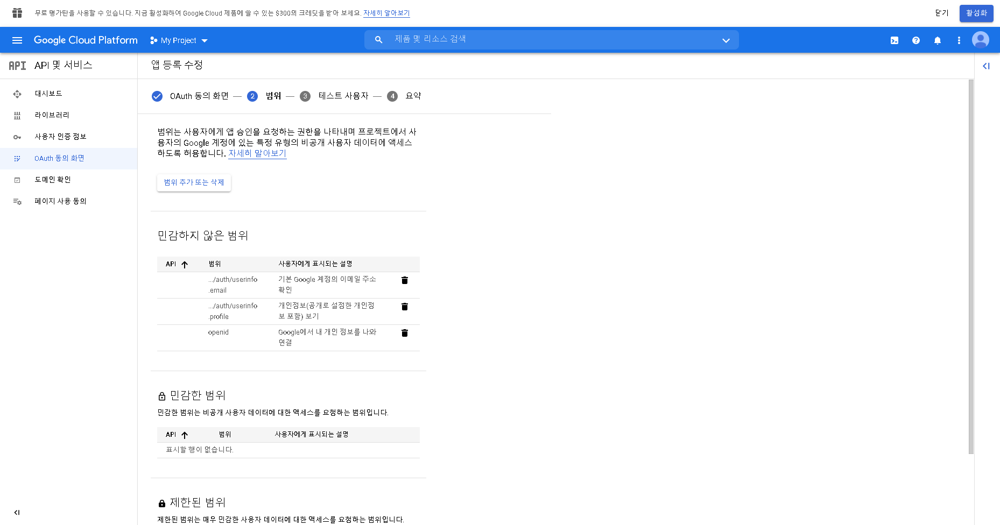

Django 프로젝트에 소셜 로그인을 추가해보기로 했다. ``django-allauth`` 패키지를 설치하고, Google OAuth를 연동하여 소셜 로그인을 하는 방법은 검색하면 많이 나왔다. 아무래도 소셜 로그인이라는 것이, 자체 회원가입 절차를 간소화할 수 있어서 사용하는 방법이다 보니 자체 회원가입과 소셜 로그인을 굳이 모두 구현하는 시도는 흔하지 않았다.

하지만 사용자에게 (Google을 비롯한) 연동할 플랫폼의 계정이 없을 수도 있기 때문에, 기존에 해오던 대로 사용자의 입력을 받아 회원가입을 하는 선택지 또한 남겨놓는 것이 개인적으로는 조금 더 강건한 서비스라고 생각했다. 

문제는 2가지 흐름을 결국 1개의 User 테이블로 귀결시켜야 한다는 점에 있었다. 자체 회원가입 기능은 내가 프로젝트에 참여하기 이전부터 **account** 라는 앱으로 구현되어 있었고, 이 앱 또한 Django에서 사용자 회원가입과 인증을 위해 Default로 제공하는 ``User Model``에 기반하고 있다. 여기다 ``allauth`` 모듈을 사용하는 소셜 로그인까지 추가하려면? 머리가 조금 아팠다. 

결정적으로 이 프로젝트에서는 **username** 필드의 값을 **사용자의 이메일**로 받고 있어서, ``allauth`` 모듈을 그대로 갖다 쓰면 기획 단계에서 설계한 **username** 필드의 무결성이 완전히 깨진다. 

사용자가 자체 회원가입을 했을 때는 **username** 필드에 이메일 값이 들어오도록 잘 구현이 되어있는데, 소셜 로그인을 이용하면 이메일이 들어와야 할 **username** 필드에 ``allauth`` 모듈의 로직에 따라 그냥 Google OAuth가 보내주는 "user"라는 단어가 뚝 들어와버리는 것이다. 그래서 모듈이 실행되는 중간에서 Google OAuth를 통해 들어오는 사용자 정보를 ~~슥 가로채서~~ 우리가 쓰는 필드에 알맞은 값이 들어가도록 커스터마이즈할 필요성도 있었다.

상황 설명은 여기까지 하고, 그래서 자체 회원가입이 구현된 Django 프로젝트에 소셜 로그인을 추가하는 방법을 기록으로 남겨보려고 한다.

## GCP Console에서 OAuth Client 설정하기

1. 일단 [Google Cloud Platform Console](https://console.cloud.google.com/)에 처음 접속하면 이것저것 동의를 요청하는 창이 뜬다. 필요한 것만 체크해준다.

    

2. 우측의 **프로젝트 만들기**를 클릭하면 창이 뜨는데, 상단의 **새 프로젝트**를 클릭한다.

	

3. 프로젝트 이름을 적고, **조직 없음**으로 선택한 뒤 프로젝트를 만들어준다.

	

4. 조금 기다리면 프로젝트가 생성이 되고 대시보드가 뜨는데, 좌측의 사이드바에 Google Cloud Platform이 제공하는 기능들이 나열되어 있다.

	

	우리는 Google OAuth API를 사용하는 것이므로 해당되는 메뉴를 선택하고, **사용자 인증 정보**를 선택한다.

	

5. **사용자 인증 정보 만들기**를 클릭하여 OAuth 클라이언트 ID를 선택한다.

	

6. 먼저 **동의 화면 구성**을 선택한다. 소셜 로그인을 할 때 사용자에게 보여질 동의 화면을 구성하는 작업이다.

	
	
7. 당연히 외부 사용자가 사용할 수 있어야 하므로 **User Type**은 외부로 설정한다.

	
	
8. 앱 정보를 기재해준다. * 표시가 붙은 필수 항목만 넣고 저장하여 다음 단계로 넘어간다.

	
	
9. 범위 설정은 Google OAuth를 통해 Google에 등록되어 있는 사용자의 정보를 어디까지 가져올지 정하는 것이다. 보통 맨 위의 3개 정도면 회원가입 목적의 사용자 정보로는 충분하다.

	
	
	체크 후 **업데이트** 버튼을 눌러 잘 설정되었는지 확인하고 넘어간다.
	
	
	
10. 앱을 게시하기 전까지는 테스트 계정을 통해 개발을 진행할 수 있다. 개발할 동안 사용할 테스트 계정을 적어주고 동의 화면 구성을 완료한다. 참고로 앱을 테스트용이 아닌 외부로 게시하기 위해서는 HTTPS로 접속할 수 있는, 그러니까 서버에 SSL 인증서를 가진 진짜 도메인이 필요하다.
	
	

	저장하면 동의 화면 구성이 완료된 것을 확인할 수 있다.

	
	
11. 다시 사이드바에서 **사용자 인증 정보** 메뉴를 선택하고, 5번에서 했던 것처럼 **사용자 인증 정보 만들기**를 클릭하여 클라이언트 ID를 발급하는 작업을 시작할 수 있다.
	
	
	
12. 해당되는 내용을 전부 채워준다. 나는 현재 ``localhost``의 8000번 포트에서 개발을 진행 중이므로 아래와 같이 채워주었지만, 각자 사용하는 ``localhost`` 주소를 넣으면 된다. Google은 보안 정책 상 **HTTPS 도메인이 아닌것은 허용하지 않는다**. 다만, 개발 목적의 ``localhost`` 만을 예외로 두고 있어 다행히도 사용할 수 있다.
리디렉션 URI는 Google OAuth에서 Google 로그인 창을 띄우기 위해 보내는 콜백을 받을 주소를 의미한다. 이미지에 나와있는 URI에서 본인의 ``localhost`` 주소만 바꿔주면 된다.

	
	
13. 전부 완료하면 클라이언트 ID와 비밀번호가 발급된다. 나중에 Django admin 페이지에 기재해주어야 하므로 적어두자.

	
	
## Django에서 소셜 로그인 연동하기

Django에서 소셜 로그인을 연동하기 위해서는 ``django-allauth`` 패키지가 필요하다. 다음 명령어를 통해 패키지를 설치해준다.

```bash
	pip install django-allauth
```

설치가 완료되면 allauth 설정을 ``settings.py``에 등록해주어야 한다.

```python
# settings.py
INSTALLED_APPS = [
	...
	'django.contrib.sites',
	'allauth',
	'allauth.account',
	'allauth.socialaccount',
	'allauth.socialaccount.providers.google',
	...
]

AUTHENTICATION_BACKENDS = (
	'django.contrib.auth.backends.ModelBackend',
	'allauth.account.auth_backends.AuthenticationBackend',
)

SITE_ID = 1

SOCIALACCOUNT_PROVIDERS = {
    'google': {
        'SCOPE': [
            'profile',
            'email'
        ],
        'AUTH_PARAMS': {
            'access_type': 'online',
        }
    }
}
```